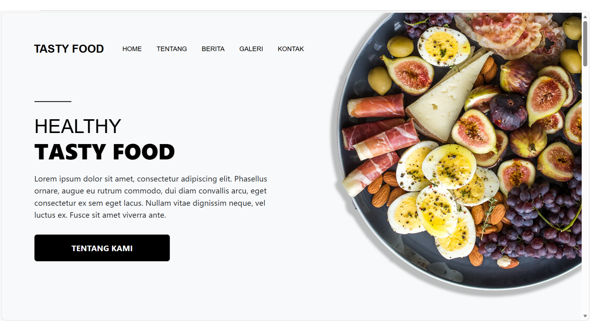
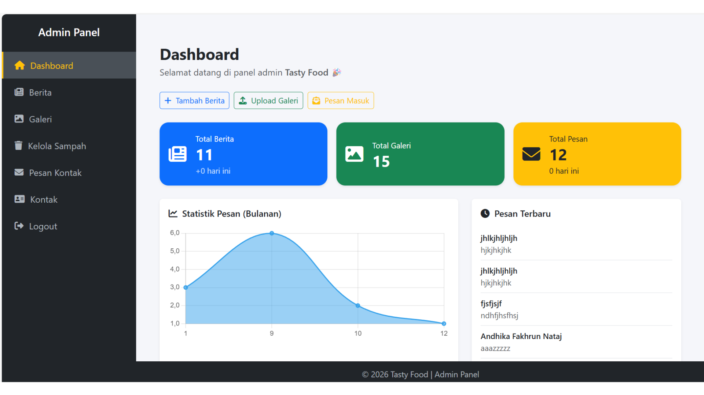
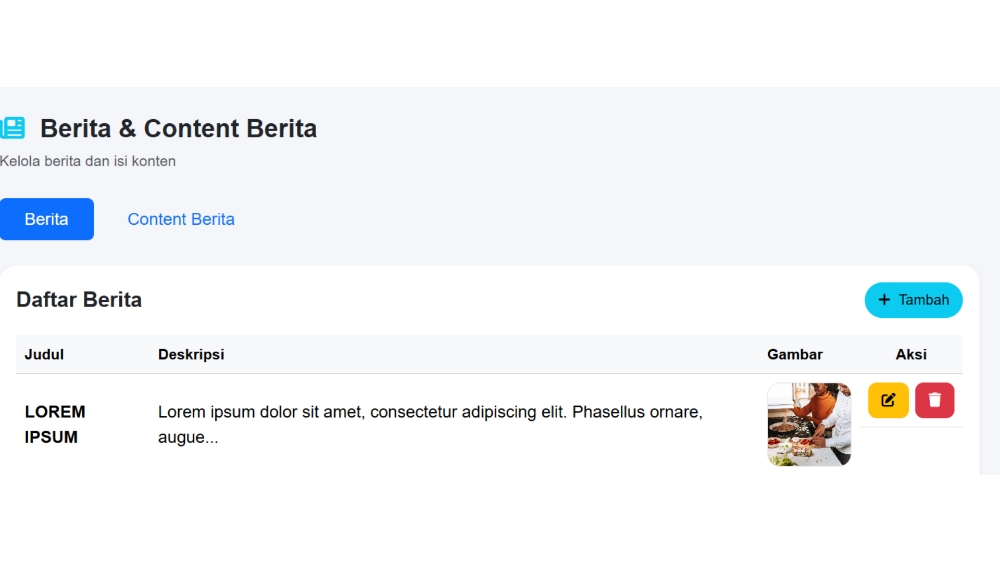

# 🍽️ TastyFood

A Laravel-based culinary company website featuring an admin panel to manage news, galleries, and contact messages.

---

## 📖 About the Project

**TastyFood** is a company profile web application designed for culinary businesses. The site displays news, photo galleries, an "About Us" page, and a contact form. Admins can manage all content through a secure panel featuring soft delete and trash management capabilities.

### Key Features

**Frontend (Public)**

* 🏠 **Home** — Landing page with essential information.
* 📰 **News** — Article listings and news details.
* 🖼️ **Gallery** — Photo gallery section.
* 📞 **Contact** — Message submission form and contact info.
* ℹ️ **About** — Company information page.

**Admin Panel**

* 🔐 Admin login.
* 📊 Dashboard.
* 📝 News CRUD (Create, Read, Update, Delete).
* 🖼️ Gallery CRUD.
* ⚙️ Contact information settings (address, email, phone).
* 📬 Inbox management for contact form messages.
* 🗑️ Trash — Restore or permanently delete soft-deleted items.

---

## 📸 Web Preview

🏠 Home Page <br>


📊 Admin Dashboard <br>


📝 News CRUD <br>


---

## 🛠️ Tech Stack

| Category | Technology |
| --- | --- |
| Backend | Laravel 12, PHP 8.2+ |
| Frontend | Blade, Tailwind CSS 4, Bootstrap 5, SASS |
| Build Tool | Vite 6 |
| Database | MySQL / SQLite (configurable) |

---

## 📋 Requirements

* **PHP** ≥ 8.2
* **Composer** 2.x
* **Node.js** ≥ 18 (for Vite & npm)
* **Database** MySQL 8+ or SQLite

---

## 🚀 Installation

### 1. Clone the repository

```bash
git clone https://github.com/USERNAME/tastyfood.git
cd tastyfood

```

### 2. Install PHP dependencies

```bash
composer install

```

### 3. Environment Setup

```bash
cp .env.example .env
php artisan key:generate

```

Edit the `.env` file to match your configuration:

* `DB_CONNECTION`, `DB_DATABASE`, `DB_USERNAME`, `DB_PASSWORD` (if using MySQL).
* Or use SQLite by setting `DB_CONNECTION=sqlite` and ensuring the `database/database.sqlite` file exists.

### 4. Database Setup

```bash
php artisan migrate
# (Optional) seed initial data:
# php artisan db:seed

```

### 5. Install Node dependencies & build assets

```bash
npm install
npm run build

```

### 6. Run the application

**Development (server + queue + logs + Vite):**

```bash
composer run dev

```

Or run them separately:

```bash
# Terminal 1 — Laravel
php artisan serve

# Terminal 2 — Vite (for asset hot reloading)
npm run dev

```

Access via:

* **Website:** http://localhost:8000
* **Admin:** http://localhost:8000/admin/login

---

## 📁 Project Structure (Summary)

```
tastyfood-new/
├── app/Http/Controllers/
│   ├── Admin/            # Admin panel controllers
│   ├── HomeController.php
│   ├── BeritaController.php
│   ├── GaleriController.php
│   ├── FrontendBeritaController.php
│   └── FrontendGaleriController.php
├── resources/views/
│   ├── layouts/          # Main layouts & partials (navbar, footer)
│   ├── admin/            # Admin panel views
│   ├── home.blade.php
│   ├── tentang.blade.php
│   ├── kontak.blade.php
│   ├── berita.blade.php
│   ├── berita-detail.blade.php
│   └── galeri.blade.php
├── routes/web.php        # Web & admin routes
├── package.json          # Vite, Tailwind, Bootstrap, SASS configs
└── composer.json         # Laravel & PHP dependencies

```

---

## 🔗 Important Routes

| URL | Description |
| --- | --- |
| `/` | Home |
| `/berita` | News list |
| `/berita/{slug}` | News details |
| `/galeri` | Gallery |
| `/kontak` | Contact |
| `/tentang` | About Us |
| `/admin/login` | Admin login |
| `/admin/dashboard` | Admin dashboard |

---

## 📄 License

This project is licensed under the [MIT](https://opensource.org/licenses/MIT) license.

---

## 👤 Contact

* **Email:** mzam.ibrahimovic@gmail.com

If you find this project useful, please consider giving credit or linking back to this repository.
